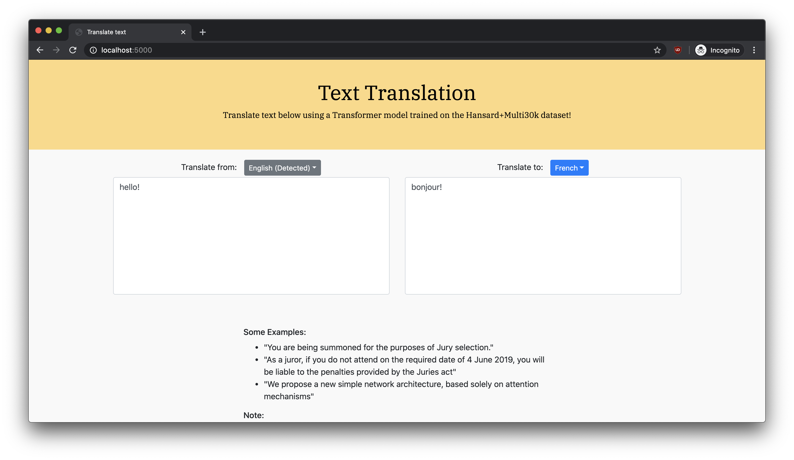

# English French Translator

## Description

The English French Translator is a web application that tries to make good translations between English and French sentences. It is equipped with two Transformer models - one for translating from English to French, and another from French to English - and was trained on the Hansard+Multi30K dataset. The model that translates from English to French achieved a BLEU score of 35.26, while the model that translates from French to English achieved a BLEU score of 35.20. It also has a Language Detector, a text classifier which uses a bag-of-words on a neural network, achieving an accuracy score of 99.36%.

## Table of Contents
* Walkthrough
* Getting Started
* Experiments
* Built With
* Credits
* License

## Walkthrough

This project consists of several components, each responsible for performing a certain task to make good translations. The image below illustrates the system architecture of the project.

The web application looks like this:

<div width="100%">
    <p align="center">

    </p>
</div>

It should detect the language and translate the text as you type.


## Getting Started

### Prerequisites
* Unix machine
* Python 3
* Pip 3

### Installation:
1. Run the following commands in **the root project directory**:

	```bash
	cd Language-Detector
	mkdir models
	cd models
	mkdir Hansard-Multi30k
	mkdir Multi30k
	cd ../../

	cd Translator
	mkdir models
	cd models
	mkdir Hansard-Multi30k
	mkdir Multi30k
	```

2. **Download** the following pre-trained models and **save** it in the following directories from https://drive.google.com/drive/folders/1C3PZYT0csQmDUoijvqnfr5w5wiZprDH_?usp=sharing:

	- (in Google Drive) ```Language Detector/Hansard-Multi30k/model.pt``` --> (in local directory) ```Language-Detector/models/Hansard-Multi30k/model.pt```

	- (in Google Drive) ```Language Detector/Hansard-Multi30k/vocab.gz``` --> (in local directory) ```Language-Detector/models/Hansard-Multi30k/vocab.gz```

	- (in Google Drive) ```Translator/Hansard-Multi30k/model.en.fr.pt``` --> (in local directory) ```Language-Detector/models/Hansard-Multi30k/model.en.fr.pt```

	- (in Google Drive) ```Translator/Hansard-Multi30k/model.fr.en.pt``` --> (in local directory) ```Language-Detector/models/Hansard-Multi30k/model.fr.en.pt```

	- (in Google Drive) ```Translator/Hansard-Multi30k/vocab.inf.5.english.gz``` --> (in local directory) ```Language-Detector/models/Hansard-Multi30k/vocab.inf.5.english.gz```

	- (in Google Drive) ```Translator/Hansard-Multi30k/vocab.inf.5.french.gz``` --> (in local directory) ```Language-Detector/models/Hansard-Multi30k/vocab.inf.5.french.gz```

3. Install the python packages for each project by **running the command**:

	```bash
	cd Translator-Webapi
	virtualenv -p python3 .
	source bin/activate
	pip3 install -r requirements.txt
	deactivate

	cd Language-Detector-Webapi
	virtualenv -p python3 .
	source bin/activate
	pip3 install -r requirements.txt
	deactivate
	```

4. Run the microservices:

	1. Launch the English-to-French Translator Web Api by opening a **new terminal window** and running **the following commands**:

		```bash
		cd Translator-Webapi
		virtualenv -p python3 .
		source bin/activate
		pip3 install -r requirements.txt
		
		export PORT=5001
		python3 app.py --source-lang en --target-lang fr
		```

	2. Launch the French-to-English Translator Web Api by opening a **new terminal window** and running **the following commands**:

		```bash
		cd Translator-Webapi
		source bin/activate
		
		export PORT=5002
		python3 app.py --source-lang fr --target-lang en
		```

	3. Launch the Language-Detector Web Api by opening a **new terminal window** and running **the following commands**:

		```bash
		cd Language-Detector-Webapi
		virtualenv -p python3 .
		source bin/activate
		pip3 install -r requirements.txt
		
		export PORT=5003
		python3 app.py
		```

	4. Launch the Web App by opening a new terminal window and running the following commands:

		```bash
		cd Webapp
		virtualenv -p python3 .
		source bin/activate
		pip3 install -r requirements.txt
		
		export PORT=5000
		export EN_FR_TRANSLATOR_ENDPOINT=http://en-fr-translator:5001
    	export FR_EN_TRANSLATOR_ENDPOINT=http://fr-en-translator:5002
    	export LANGUAGE_DETECTOR_ENDPOINT=http://language-detector:5003
		python3 app.py
		```

4. On your browser, go to ```http://localhost:5000```

### Training the model from scratch [Optional]:
Instead of using pre-trained models, you can train the models from scratch

1. Training the **Language-Detector**:
	1. Use a **Google Account** to *upload* the following folders to **Google Drive**:
		- Language-Detector/data
		- Language-Detector/scripts
		- Language-Detector/src

	2. Create the following **directories on Google Drive**:
		- Language-Detector/models/Hansard-Multi30k

	3. Open ```Language-Detector/scripts/Notebook - Hansard+Multi30k.ipynb``` on **Google Colab**
	4. Follow the **instructions on Google Colab**

2. Training the **Translator**:
	1. Use a **Google Account** to *upload* the following folders to **Google Drive**:
		- Translator/data
		- Translator/scripts
		- Translator/src

	2. Create the following **directories on Google Drive**:
		- Translator/models/Hansard-Multi30k

	3. Open ```Translator/scripts/Notebook - Hansard+Multi30k.ipynb``` on **Google Colab**
	4. Follow the **instructions on Google Colab**


## Experiments
Several experiments were conducted on the Multi30k dataset before using the Transformer as the model for the web app

Notebook links:
1. Experimenting NMT using RNNs: [Notebook](Translator/notebooks/NMT%20using%20RNNs.ipynb)
2. Experimenting NMT using RNNs with Attention: [Notebook](Translator/notebooks/NMT%20using%20RNNs%20with%20Attention.ipynb)
3. Experimenting NMT using Transformers: [Notebook](Translator/notebooks/NMT%20using%20Transformers.ipynb)
4. Experimenting Text Classification using Bag of Words: [Notebook](Language-Detector/notebooks/Text%20Classification%20using%20Bag%20of%20Words.ipynb)

Results:
|                         | NMT using RNNs | NMT using RNNs with Luong Attention | NMT using Transformers |
|-------------------------|----------------|-------------------------------------|------------------------|
| Dev Test Loss Score     | 2.029          | 1.989                               | 1.922                  |
| Dev Test Set BLEU Score | 24.14          | 27.24                               | 36.83                  |
| Test Set Loss Score     | 1.98           | 1.98                                | 1.574                  |
| Test Set BLEU Score     | 29.38          | 29.38                               | 42.94                  |

|                         | Text Classification using Bag of Words |
|-------------------------|----------------------------------------|
| Dev Test Loss Score     | 5.674499565238241e-10                  |
| Dev Test Set Accuracy   | 0.9931                                 |
| Test Set Loss Score     | 2.8081064123368606e-06                 |
| Test Set Accuracy       | 0.9941                                 |


## Deploying the Web App to Heroku
1. Login to Heroku by **running the command**:
	
	```bash
	heroku container:login
	```

1. On the **Heroku webpage**, add these **config** (environment) variables in the ```fr-2-en-translator``` app:

	```
	SOURCE_LANG : fr
	TARGET_LANG : en
	```

2. On the **Heroku webpage**, add these **config** (environment) variables in the ```en-2-fr-translator``` app:

	```
	SOURCE_LANG : en
	TARGET_LANG : fr
	```

3. On the **Heroku webpage**, add these **config** (environment) variables in the ```en-fr-translator``` app:

	```
	EN_FR_TRANSLATOR_ENDPOINT : https://en-2-fr-translator.herokuapp.com
	FR_EN_TRANSLATOR_ENDPOINT : https://fr-2-en-translator.herokuapp.com
    LANGUAGE_DETECTOR_ENDPOINT : https://en-fr-language-detector.herokuapp.com
	```

4. In the **project root directory**, build, push, and deploy the Docker image to the ```fr-2-en-translator``` app by **running the following commands**:
	
	```bash
	docker build -t en2fr -f Translator-Webapi/Dockerfile .
	docker tag en2fr registry.heroku.com/en-2-fr-translator/web
	docker push registry.heroku.com/en-2-fr-translator/web
	heroku container:release web --app en-2-fr-translator
	```

5. In the **project root directory**, build, push, and deploy the Docker image to the ```en-2-fr-translator``` app by **running the following commands**:
	
	```bash
	docker build -t fr2en -f Translator-Webapi/Dockerfile .
	docker tag fr2en registry.heroku.com/fr-2-en-translator/web
	docker push registry.heroku.com/fr-2-en-translator/web
	heroku container:release web --app fr-2-en-translator
	```

6. In the **project root directory**, build, push, and deploy the Docker image to the ```en-fr-language-detector``` app by **running the following commands**:
	
	```bash
	docker build -t language-detector -f Language-Detector-Webapi/Dockerfile .
	docker tag language-detector registry.heroku.com/en-fr-language-detector/web
	docker push registry.heroku.com/en-fr-language-detector/web
	heroku container:release web --app en-fr-language-detector
	```

7. In the **project root directory**, build, push, and deploy the Docker image to the ```en-fr-translator``` app by **running the following commands**:
	
	```bash
	docker build -t en-fr -f Webapp/Dockerfile .
	docker tag en-fr registry.heroku.com/en-fr-translator/web
	docker push registry.heroku.com/en-fr-translator/web
	heroku container:release web --app en-fr-translator
	```

## Built With

* [PyTorch](https://pytorch.org/) - The machine learning framework used
* [Spacy](https://spacy.io/) - Used to do sentence and word tokenization in the translator
* [Ntlk](https://www.nltk.org/) - Used to do word tokenization in the language detector
* [Flask](https://flask.palletsprojects.com/en/1.1.x/) - The web framework used

## Credits

* Emilio Kartono, who made the project
* Resources used to make the project:
	* http://www.cs.toronto.edu/~frank/csc401/
	* https://github.com/bentrevett/pytorch-seq2seq/blob/master/6%20-%20Attention%20is%20All%20You%20Need.ipynb
	* http://www.peterbloem.nl/blog/transformers
	* https://lilianweng.github.io/lil-log/2018/06/24/attention-attention.html
	* https://homes.cs.washington.edu/~msap/notes/seq2seq-tricks.html


## License

This project is licensed under the MIT License - see the [LICENSE.md](LICENSE.md) file for details

